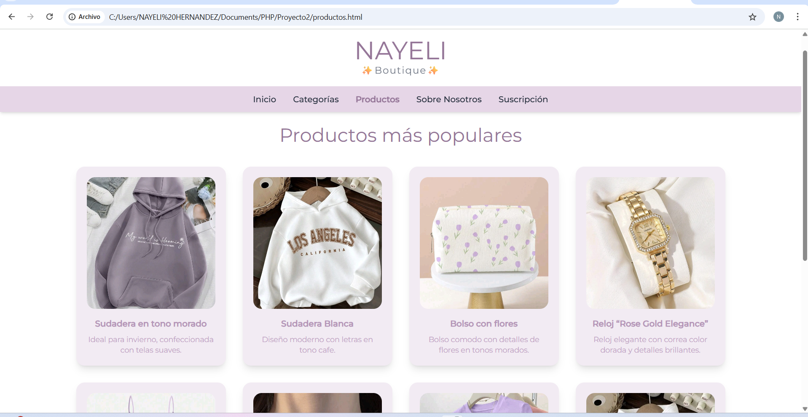
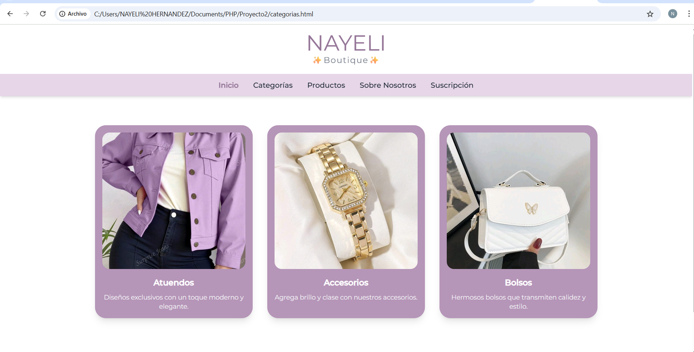
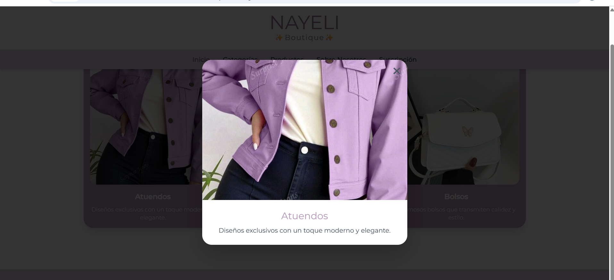
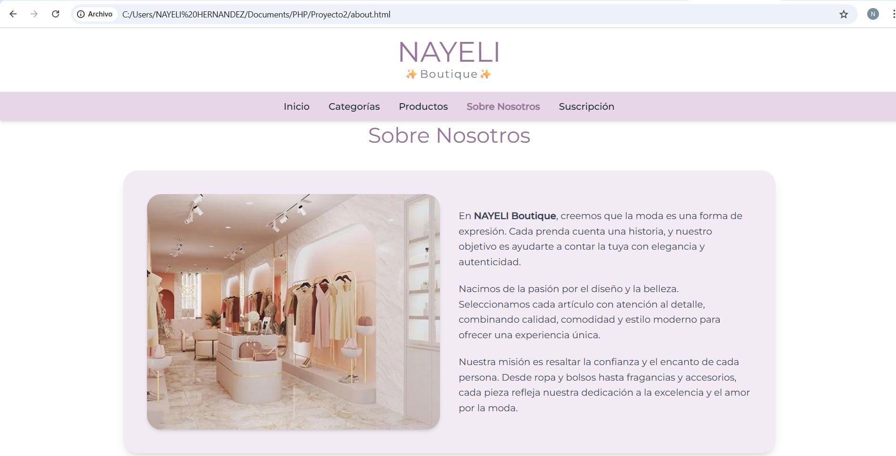
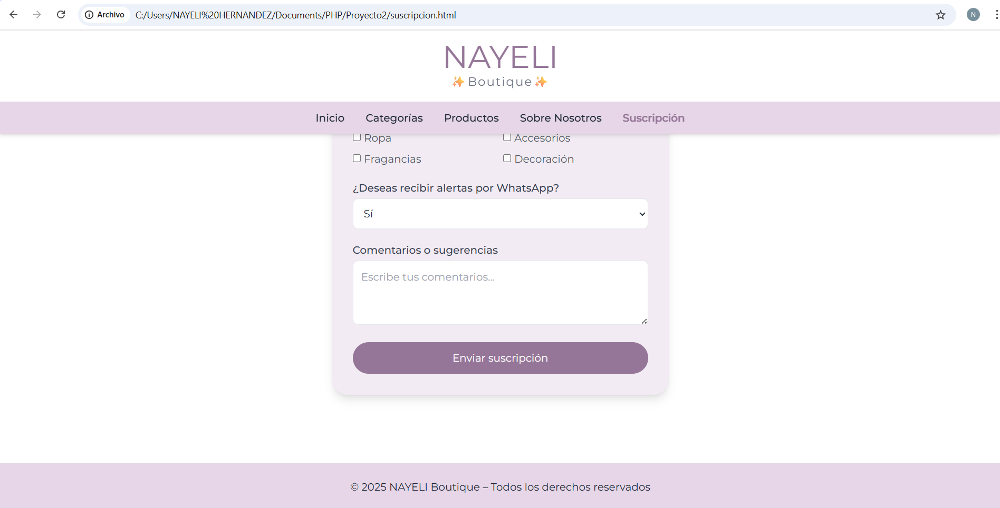

# Instituto Tecnológico José Mario Molina Pasquel y Hernríquez

## 🎨 Actividad #12:Diseño y Desarrollo de Página Web

### Carrera: Ing. Sistemas Computacionales

### Alumno: Nayeli Hernandez Ramirez

### No. Control: 220110344

### Docente: MTRO. Pedro Espinosa Esparza

## Intrucciones

Documentar partes del codigo HTML

## Introducción

El propósito de este documento es describir la estructura del código HTML. Se analizan las partes principales del documento y su función dentro de la interfaz, destacando la importancia del uso de etiquetas semánticas que favorecen la accesibilidad, organización y usabilidad del sistema.

## Estructura del Código HTML

A continuación se explica la función de cada bloque del código:

---

### Declaración del documento

```html
<!DOCTYPE html>
```

Indica al navegador que se está utilizando la especificación HTML5, permitiendo una interpretación moderna del contenido del sitio.

### Etiqueta raíz <html>

html

```HTML
<html lang="es">
```

Establece el inicio del documento y define el idioma español, lo cual mejora la accesibilidad y el SEO.

### Footer (Pie de página)

```HTML
<footer>
    © 2025 NAYELI
</footer>
```

Brinda información final como derechos de autor.

### CSS (Tailwind + estilos personalizados)

Tailwind CSS facilita crear un diseño moderno sin escribir demasiadas reglas CSS:

```HTML
<section class="bg-white shadow-lg rounded-lg p-6">
```

Esto es para crear una tarjeta con fondo blanco, bordes redondeados y sombra para resaltar contenido.

También se usan colores personalizados.

El menú aparece en todas las páginas y permite una navegación fácil.
Está hecho con una lista de enlaces `HTML<ul><li><a></a></li></ul> `y se le aplican clases de Tailwind para diseño.

Fragmento del código importante:

```HTML
<nav class="bg-[#e6d6e7] p-4 sticky top-0 shadow-md">
  <ul class="flex justify-center space-x-8">
    <li><a href="index.html" class="text-gray-700 hover:text-[#957698] font-semibold">Inicio</a></li>
    <li><a href="categorias.html" class="text-gray-700 hover:text-[#957698] font-semibold">Categorías</a></li>
    <li><a href="productos.html" class="text-gray-700 hover:text-[#957698] font-semibold">Productos</a></li>
    <li><a href="suscripcion.html" class="text-gray-700 hover:text-[#957698] font-semibold">Suscripción</a></li>
  </ul>
</nav>
```

| Característica          | Beneficio                                  |
| ----------------------- | ------------------------------------------ |
| `sticky top-0`          | El menú siempre visible al bajar la página |
| `hover:text`            | Retroalimentación al usuario               |
| `shadow-md`             | Se destaca por encima del contenido        |
| Uso de colores de marca | Identidad visual coherente                 |

El sitio tiene imágenes tanto decorativas como de productos.

Fondo en la página principal (Hero Section)

Se utiliza CSS inline con Tailwind para que la imagen cubra toda la sección:

```HTML
<header class="h-screen bg-cover bg-center"
style="background-image: url('img/hero.jpg');">
  <div class="bg-black bg-opacity-30 h-full flex items-center justify-center">
    <h1 class="text-white text-5xl font-playfair">NAYELI Boutique</h1>
  </div>
</header>
```

| Propiedad         | Función                                  |
| ----------------- | ---------------------------------------- |
| `bg-cover`        | La imagen cubre el ancho completo        |
| `bg-center`       | Se centra la parte importante de la foto |
| `bg-opacity-30`   | Se oscurece el fondo para resaltar texto |
| `h-screen`        | Toma toda la altura de la pantalla       |
| Capa negra encima | Mejora lectura del texto                 |

Diseño para desktop








### Diseño para móvil


### Diseño para tablet


